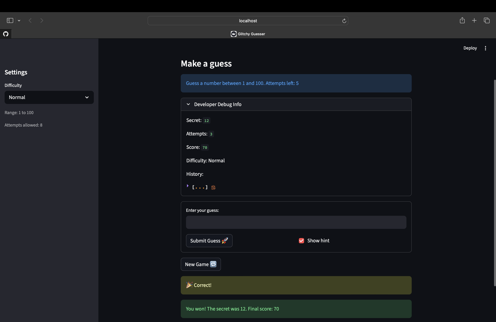

# 🎮 Game Glitch Investigator: The Impossible Guesser

## 🚨 The Situation

You asked an AI to build a simple "Number Guessing Game" using Streamlit.
It wrote the code, ran away, and now the game is unplayable. 

- You can't win.
- The hints lie to you.
- The secret number seems to have commitment issues.

## 🛠️ Setup

1. Install dependencies: `pip install -r requirements.txt`
2. Run the broken app: `python -m streamlit run app.py`

## 🕵️‍♂️ Your Mission

1. **Play the game.** Open the "Developer Debug Info" tab in the app to see the secret number. Try to win.
2. **Find the State Bug.** Why does the secret number change every time you click "Submit"? Ask ChatGPT: *"How do I keep a variable from resetting in Streamlit when I click a button?"*
3. **Fix the Logic.** The hints ("Higher/Lower") are wrong. Fix them.
4. **Refactor & Test.** - Move the logic into `logic_utils.py`.
   - Run `pytest` in your terminal.
   - Keep fixing until all tests pass!

## 📝 Document Your Experience

- [x] Describe the game's purpose.

  It is a number guessing game. The player picks a difficulty (Easy/Normal/Hard), which sets a numeric range and attempt limit. Each round, a secret number is randomly chosen and the player submits guesses, receiving "Go Higher" or "Go Lower" hints after each one. Points are awarded for winning and deducted per wrong guess. The goal is to guess the secret number before running out of attempts.

- [x] Detail which bugs you found.

  1. **Swapped hints** — "Go Higher" and "Go Lower" messages were reversed, so the hints pointed the player in the wrong direction.
  2. **Hint out of sync with guess** — On a win or loss, `st.rerun()` was not called, so the feedback message (e.g. "🎉 Correct!") stored in `session_state` was never displayed on screen at the right time. The old hint from the previous guess remained visible.
  3. **Balloons firing on every rerun** — After winning, `st.balloons()` was called unconditionally inside the status check block, so it triggered again every time the page re-rendered (e.g. if the user submitted another guess).
  4. **No "already won" message** — There was no distinction between the first win render and subsequent renders, so the "You already won" message never appeared and the game accepted more guesses after a win.

- [x] Explain what fixes you applied.

  1. **Fixed swapped hints** in `logic_utils.py` — swapped the return values so "Too High" maps to "Go LOWER!" and "Too Low" maps to "Go HIGHER!".
  2. **Added `st.rerun()` to all branches** in `app.py` — win, loss, and incorrect guesses all now call `st.rerun()`, so the hint in `session_state` is always displayed in sync with the latest guess result.
  3. **Moved win/loss display to the status-check section** — removed `st.success`/`st.error` from the submit block and handled them in the top-level status check that runs first on every rerun, keeping display logic in one place.
  4. **Added a two-phase win status** — status transitions from `"won"` (first display: balloons + full win message) to `"won_seen"` (subsequent renders: "You already won" message, no balloons). `st.stop()` prevents any further guess processing in both states.

## 📸 Demo

## 🚀 Stretch Features

- [ ] [If you choose to complete Challenge 4, insert a screenshot of your Enhanced Game UI here]
